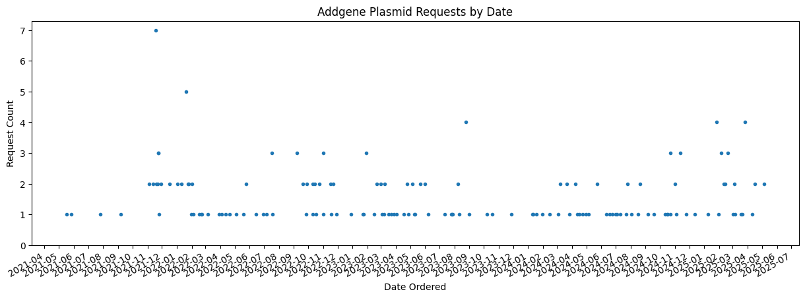
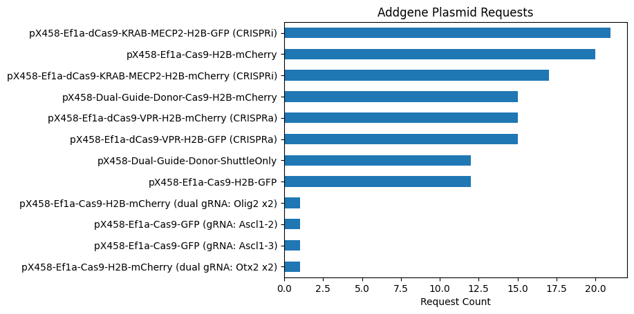
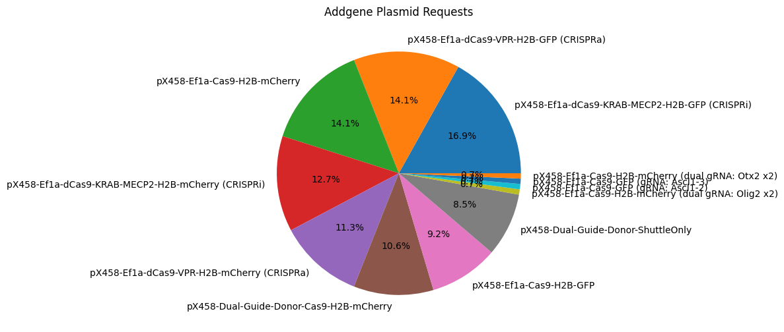
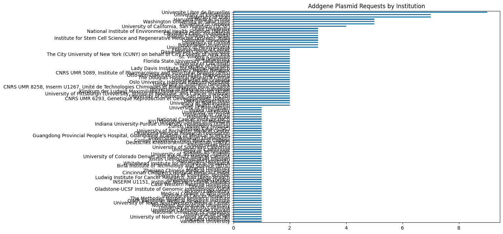
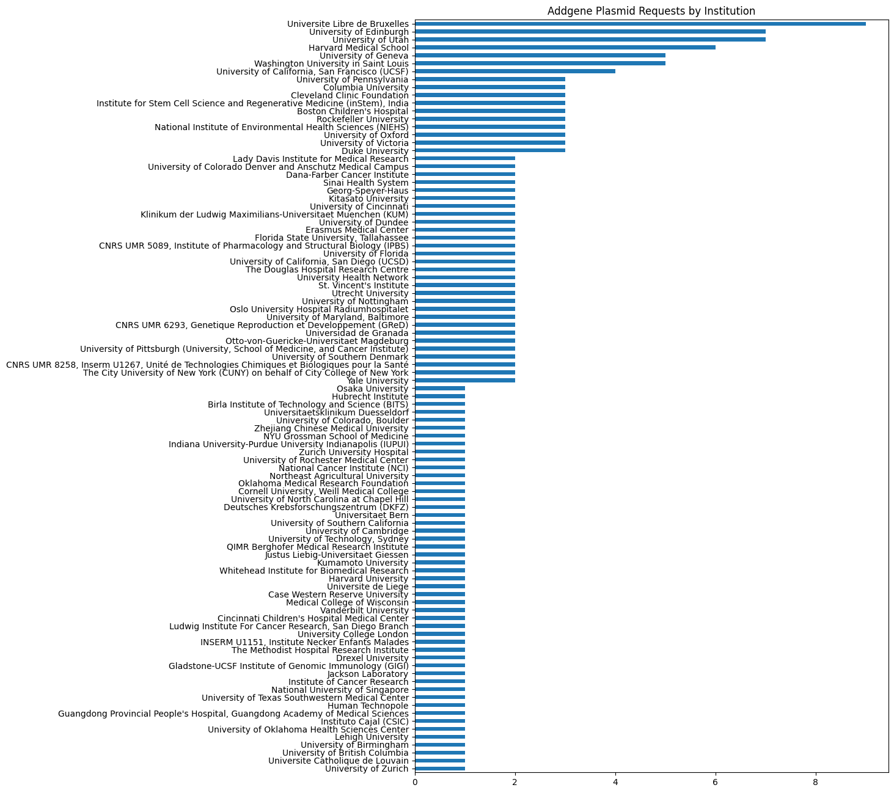

# Analysis of Brzezinski Lab Plasmid Requests from Addgene

https://www.addgene.org/depositor-collections/brzezinski-lab-crispr-collection/


```python
import pandas as pd
import matplotlib.dates as mdates
from IPython.display import display, Markdown
from IPython.display import Markdown as md
import glob

csvfile = glob.glob('*.csv')

df = pd.read_csv(csvfile[0])

number = df['Material'].value_counts().sum()
last_date = df['Date Ordered'][0]

md("# Total number of lab plasmids requested: {} as of {}.".format(number, last_date))


```


# Total number of lab plasmids requested: 142 as of 01/18/2024.


## Requests by Date


```python
half_year_locator = mdates.MonthLocator(interval=1)
year_month_formatter = mdates.DateFormatter("%Y-%m") # four digits for year, two for month'Addgene-Requests-for-Materials-Michael-Kaufman-2005-2023-2023-Mar-08-18-40.csv
monthly_locator = mdates.MonthLocator()


ax = pd.to_datetime(df['Date Ordered']).value_counts().plot(title='Addgene Plasmid Requests by Date', figsize=(15, 5), style='.')

ax.set_ylabel('Request Count')
ax.set_ylim(0)
ax.xaxis.set_major_locator(half_year_locator)
ax.xaxis.set_minor_locator(monthly_locator)
ax.xaxis.set_major_formatter(year_month_formatter)

```


    

    


## Request Count


```python
(
df['Material']
.value_counts()
.sort_values()
.plot(kind='barh', title='Addgene Plasmid Requests')
.set_xlabel('Request Count')
);
```


    

    


## Request by Percent


```python
(
df['Material']
.value_counts()
.plot(kind='pie', title='Addgene Plasmid Requests', autopct='%1.1f%%', figsize=(6, 6))
.set_ylabel('')
);
```


    

    


## Requesting Institution


```python
(
df['Requesting Organization']
.value_counts()
.sort_values()
.plot(kind='barh', title='Addgene Plasmid Requests by Institution', figsize=(10, 8))
.set_ylabel('')
);
```


    

    


## Requesting Country


```python
(
df['Requesting Country']
.value_counts()
.plot(kind='pie', title='Addgene Plasmid Requests by Country', autopct='%1.1f%%', figsize=(6, 6))
.set_ylabel('')
);
```


    

    


## Plasmid Request List


```python
pd.set_option('display.max_rows', None)
df
```


<div>
<style scoped>
    .dataframe tbody tr th:only-of-type {
        vertical-align: middle;
    }

    .dataframe tbody tr th {
        vertical-align: top;
    }

    .dataframe thead th {
        text-align: right;
    }
</style>
<table border="1" class="dataframe">
  <thead>
    <tr style="text-align: right;">
      <th></th>
      <th>ID</th>
      <th>Material</th>
      <th>Requesting PI</th>
      <th>Requesting Organization</th>
      <th>Requesting Country</th>
      <th>Date Ordered</th>
    </tr>
  </thead>
  <tbody>
    <tr>
      <th>0</th>
      <td>175571</td>
      <td>pX458-Ef1a-dCas9-VPR-H2B-GFP (CRISPRa)</td>
      <td>Mark Emerson</td>
      <td>The City University of New York (CUNY) on beha...</td>
      <td>UNITED STATES</td>
      <td>01/18/2024</td>
    </tr>
    <tr>
      <th>1</th>
      <td>175574</td>
      <td>pX458-Ef1a-dCas9-KRAB-MECP2-H2B-mCherry (CRISPRi)</td>
      <td>Tomasz Nowakowski</td>
      <td>University of California, San Francisco (UCSF)</td>
      <td>UNITED STATES</td>
      <td>01/11/2024</td>
    </tr>
    <tr>
      <th>2</th>
      <td>175571</td>
      <td>pX458-Ef1a-dCas9-VPR-H2B-GFP (CRISPRa)</td>
      <td>Elvir Becirovic</td>
      <td>Zurich University Hospital</td>
      <td>SWITZERLAND</td>
      <td>01/10/2024</td>
    </tr>
    <tr>
      <th>3</th>
      <td>175571</td>
      <td>pX458-Ef1a-dCas9-VPR-H2B-GFP (CRISPRa)</td>
      <td>Jorge Garcia-Marques</td>
      <td>Instituto Cajal (CSIC)</td>
      <td>SPAIN</td>
      <td>11/27/2023</td>
    </tr>
    <tr>
      <th>4</th>
      <td>159654</td>
      <td>pX458-Ef1a-Cas9-H2B-GFP</td>
      <td>Jacques Robert</td>
      <td>University of Rochester Medical Center</td>
      <td>UNITED STATES</td>
      <td>10/18/2023</td>
    </tr>
    <tr>
      <th>5</th>
      <td>175573</td>
      <td>pX458-Ef1a-dCas9-KRAB-MECP2-H2B-GFP (CRISPRi)</td>
      <td>Fang Mu</td>
      <td>Northeast Agricultural University</td>
      <td>CHINA</td>
      <td>10/08/2023</td>
    </tr>
    <tr>
      <th>6</th>
      <td>175573</td>
      <td>pX458-Ef1a-dCas9-KRAB-MECP2-H2B-GFP (CRISPRi)</td>
      <td>Phillip Grote</td>
      <td>Georg-Speyer-Haus</td>
      <td>GERMANY</td>
      <td>09/01/2023</td>
    </tr>
    <tr>
      <th>7</th>
      <td>175571</td>
      <td>pX458-Ef1a-dCas9-VPR-H2B-GFP (CRISPRa)</td>
      <td>Huashan Peng</td>
      <td>The Douglas Hospital Research Centre</td>
      <td>CANADA</td>
      <td>08/25/2023</td>
    </tr>
    <tr>
      <th>8</th>
      <td>175572</td>
      <td>pX458-Ef1a-dCas9-VPR-H2B-mCherry (CRISPRa)</td>
      <td>Huashan Peng</td>
      <td>The Douglas Hospital Research Centre</td>
      <td>CANADA</td>
      <td>08/25/2023</td>
    </tr>
    <tr>
      <th>9</th>
      <td>175571</td>
      <td>pX458-Ef1a-dCas9-VPR-H2B-GFP (CRISPRa)</td>
      <td>Severin Gylstorff</td>
      <td>Otto-von-Guericke-Universitaet Magdeburg</td>
      <td>GERMANY</td>
      <td>08/25/2023</td>
    </tr>
    <tr>
      <th>10</th>
      <td>175573</td>
      <td>pX458-Ef1a-dCas9-KRAB-MECP2-H2B-GFP (CRISPRi)</td>
      <td>Severin Gylstorff</td>
      <td>Otto-von-Guericke-Universitaet Magdeburg</td>
      <td>GERMANY</td>
      <td>08/25/2023</td>
    </tr>
    <tr>
      <th>11</th>
      <td>175573</td>
      <td>pX458-Ef1a-dCas9-KRAB-MECP2-H2B-GFP (CRISPRi)</td>
      <td>Swapan Nath</td>
      <td>Oklahoma Medical Research Foundation</td>
      <td>UNITED STATES</td>
      <td>08/11/2023</td>
    </tr>
    <tr>
      <th>12</th>
      <td>175573</td>
      <td>pX458-Ef1a-dCas9-KRAB-MECP2-H2B-GFP (CRISPRi)</td>
      <td>Jason Watts</td>
      <td>National Institute of Environmental Health Sci...</td>
      <td>UNITED STATES</td>
      <td>08/08/2023</td>
    </tr>
    <tr>
      <th>13</th>
      <td>175574</td>
      <td>pX458-Ef1a-dCas9-KRAB-MECP2-H2B-mCherry (CRISPRi)</td>
      <td>Jason Watts</td>
      <td>National Institute of Environmental Health Sci...</td>
      <td>UNITED STATES</td>
      <td>08/08/2023</td>
    </tr>
    <tr>
      <th>14</th>
      <td>175571</td>
      <td>pX458-Ef1a-dCas9-VPR-H2B-GFP (CRISPRa)</td>
      <td>Gabriel Leprivier</td>
      <td>Universitaetsklinikum Duesseldorf</td>
      <td>GERMANY</td>
      <td>07/28/2023</td>
    </tr>
    <tr>
      <th>15</th>
      <td>175573</td>
      <td>pX458-Ef1a-dCas9-KRAB-MECP2-H2B-GFP (CRISPRi)</td>
      <td>Dan-Avi Landau</td>
      <td>Cornell University, Weill Medical College</td>
      <td>UNITED STATES</td>
      <td>07/27/2023</td>
    </tr>
    <tr>
      <th>16</th>
      <td>175571</td>
      <td>pX458-Ef1a-dCas9-VPR-H2B-GFP (CRISPRa)</td>
      <td>Andreas Trumpp</td>
      <td>Deutsches Krebsforschungszentrum (DKFZ)</td>
      <td>GERMANY</td>
      <td>07/26/2023</td>
    </tr>
    <tr>
      <th>17</th>
      <td>159655</td>
      <td>pX458-Ef1a-Cas9-H2B-mCherry</td>
      <td>Deborah Stroka</td>
      <td>Universitaet Bern</td>
      <td>SWITZERLAND</td>
      <td>07/11/2023</td>
    </tr>
    <tr>
      <th>18</th>
      <td>175573</td>
      <td>pX458-Ef1a-dCas9-KRAB-MECP2-H2B-GFP (CRISPRi)</td>
      <td>Brian Clark</td>
      <td>Washington University in Saint Louis</td>
      <td>UNITED STATES</td>
      <td>06/07/2023</td>
    </tr>
    <tr>
      <th>19</th>
      <td>159655</td>
      <td>pX458-Ef1a-Cas9-H2B-mCherry</td>
      <td>Eric Goetzman</td>
      <td>University of Pittsburgh (University, School o...</td>
      <td>UNITED STATES</td>
      <td>06/01/2023</td>
    </tr>
    <tr>
      <th>20</th>
      <td>171098</td>
      <td>pX458-Dual-Guide-Donor-ShuttleOnly</td>
      <td>Eric Goetzman</td>
      <td>University of Pittsburgh (University, School o...</td>
      <td>UNITED STATES</td>
      <td>06/01/2023</td>
    </tr>
    <tr>
      <th>21</th>
      <td>175573</td>
      <td>pX458-Ef1a-dCas9-KRAB-MECP2-H2B-GFP (CRISPRi)</td>
      <td>David Landeira Frías</td>
      <td>Universidad de Granada</td>
      <td>SPAIN</td>
      <td>05/22/2023</td>
    </tr>
    <tr>
      <th>22</th>
      <td>175574</td>
      <td>pX458-Ef1a-dCas9-KRAB-MECP2-H2B-mCherry (CRISPRi)</td>
      <td>David Landeira Frías</td>
      <td>Universidad de Granada</td>
      <td>SPAIN</td>
      <td>05/22/2023</td>
    </tr>
    <tr>
      <th>23</th>
      <td>175574</td>
      <td>pX458-Ef1a-dCas9-KRAB-MECP2-H2B-mCherry (CRISPRi)</td>
      <td>Scott E. Fraser</td>
      <td>University of Southern California</td>
      <td>UNITED STATES</td>
      <td>05/11/2023</td>
    </tr>
    <tr>
      <th>24</th>
      <td>159654</td>
      <td>pX458-Ef1a-Cas9-H2B-GFP</td>
      <td>Harveer Dev Singh</td>
      <td>University of Cambridge</td>
      <td>UNITED KINGDOM</td>
      <td>05/09/2023</td>
    </tr>
    <tr>
      <th>25</th>
      <td>175572</td>
      <td>pX458-Ef1a-dCas9-VPR-H2B-mCherry (CRISPRa)</td>
      <td>Kellie Lucken</td>
      <td>University of Nottingham</td>
      <td>UNITED KINGDOM</td>
      <td>05/05/2023</td>
    </tr>
    <tr>
      <th>26</th>
      <td>175574</td>
      <td>pX458-Ef1a-dCas9-KRAB-MECP2-H2B-mCherry (CRISPRi)</td>
      <td>Kellie Lucken</td>
      <td>University of Nottingham</td>
      <td>UNITED KINGDOM</td>
      <td>05/05/2023</td>
    </tr>
    <tr>
      <th>27</th>
      <td>175570</td>
      <td>pX458-Dual-Guide-Donor-Cas9-H2B-mCherry</td>
      <td>Magda Bienko</td>
      <td>Human Technopole</td>
      <td>ITALY</td>
      <td>04/27/2023</td>
    </tr>
    <tr>
      <th>28</th>
      <td>159654</td>
      <td>pX458-Ef1a-Cas9-H2B-GFP</td>
      <td>Attila Aszodi</td>
      <td>Klinikum der Ludwig Maximilians-Universitaet M...</td>
      <td>GERMANY</td>
      <td>04/25/2023</td>
    </tr>
    <tr>
      <th>29</th>
      <td>159655</td>
      <td>pX458-Ef1a-Cas9-H2B-mCherry</td>
      <td>Attila Aszodi</td>
      <td>Klinikum der Ludwig Maximilians-Universitaet M...</td>
      <td>GERMANY</td>
      <td>04/25/2023</td>
    </tr>
    <tr>
      <th>30</th>
      <td>159655</td>
      <td>pX458-Ef1a-Cas9-H2B-mCherry</td>
      <td>Nham Tran</td>
      <td>University of Technology, Sydney</td>
      <td>AUSTRALIA</td>
      <td>04/18/2023</td>
    </tr>
    <tr>
      <th>31</th>
      <td>159655</td>
      <td>pX458-Ef1a-Cas9-H2B-mCherry</td>
      <td>Titia de Lange</td>
      <td>Rockefeller University</td>
      <td>UNITED STATES</td>
      <td>04/03/2023</td>
    </tr>
    <tr>
      <th>32</th>
      <td>175574</td>
      <td>pX458-Ef1a-dCas9-KRAB-MECP2-H2B-mCherry (CRISPRi)</td>
      <td>Katalin Susztak</td>
      <td>University of Pennsylvania</td>
      <td>UNITED STATES</td>
      <td>03/28/2023</td>
    </tr>
    <tr>
      <th>33</th>
      <td>171098</td>
      <td>pX458-Dual-Guide-Donor-ShuttleOnly</td>
      <td>Chandra Choudhury</td>
      <td>QIMR Berghofer Medical Research Institute</td>
      <td>AUSTRALIA</td>
      <td>03/22/2023</td>
    </tr>
    <tr>
      <th>34</th>
      <td>175570</td>
      <td>pX458-Dual-Guide-Donor-Cas9-H2B-mCherry</td>
      <td>Chad Pearson</td>
      <td>University of Colorado Denver and Anschutz Med...</td>
      <td>UNITED STATES</td>
      <td>03/17/2023</td>
    </tr>
    <tr>
      <th>35</th>
      <td>175572</td>
      <td>pX458-Ef1a-dCas9-VPR-H2B-mCherry (CRISPRa)</td>
      <td>Prof. Dr. Dr. Knut Stieger</td>
      <td>Justus Liebig-Universitaet Giessen</td>
      <td>GERMANY</td>
      <td>03/09/2023</td>
    </tr>
    <tr>
      <th>36</th>
      <td>175572</td>
      <td>pX458-Ef1a-dCas9-VPR-H2B-mCherry (CRISPRa)</td>
      <td>Toru Takeo</td>
      <td>Kumamoto University</td>
      <td>JAPAN</td>
      <td>03/09/2023</td>
    </tr>
    <tr>
      <th>37</th>
      <td>175570</td>
      <td>pX458-Dual-Guide-Donor-Cas9-H2B-mCherry</td>
      <td>David Bartel</td>
      <td>Whitehead Institute for Biomedical Research</td>
      <td>UNITED STATES</td>
      <td>03/07/2023</td>
    </tr>
    <tr>
      <th>38</th>
      <td>159655</td>
      <td>pX458-Ef1a-Cas9-H2B-mCherry</td>
      <td>Titia de Lange</td>
      <td>Rockefeller University</td>
      <td>UNITED STATES</td>
      <td>03/03/2023</td>
    </tr>
    <tr>
      <th>39</th>
      <td>175571</td>
      <td>pX458-Ef1a-dCas9-VPR-H2B-GFP (CRISPRa)</td>
      <td>Uttiya Basu</td>
      <td>Columbia University</td>
      <td>UNITED STATES</td>
      <td>03/01/2023</td>
    </tr>
    <tr>
      <th>40</th>
      <td>175572</td>
      <td>pX458-Ef1a-dCas9-VPR-H2B-mCherry (CRISPRa)</td>
      <td>Uttiya Basu</td>
      <td>Columbia University</td>
      <td>UNITED STATES</td>
      <td>03/01/2023</td>
    </tr>
    <tr>
      <th>41</th>
      <td>175573</td>
      <td>pX458-Ef1a-dCas9-KRAB-MECP2-H2B-GFP (CRISPRi)</td>
      <td>KHAMLICHI AMINE</td>
      <td>CNRS UMR 5089, Institute of Pharmacology and S...</td>
      <td>FRANCE</td>
      <td>02/20/2023</td>
    </tr>
    <tr>
      <th>42</th>
      <td>175574</td>
      <td>pX458-Ef1a-dCas9-KRAB-MECP2-H2B-mCherry (CRISPRi)</td>
      <td>KHAMLICHI AMINE</td>
      <td>CNRS UMR 5089, Institute of Pharmacology and S...</td>
      <td>FRANCE</td>
      <td>02/20/2023</td>
    </tr>
    <tr>
      <th>43</th>
      <td>175573</td>
      <td>pX458-Ef1a-dCas9-KRAB-MECP2-H2B-GFP (CRISPRi)</td>
      <td>Dr. Deepak Chitkara</td>
      <td>Birla Institute of Technology and Science (BITS)</td>
      <td>INDIA</td>
      <td>02/15/2023</td>
    </tr>
    <tr>
      <th>44</th>
      <td>159654</td>
      <td>pX458-Ef1a-Cas9-H2B-GFP</td>
      <td>Joe Corbo</td>
      <td>Washington University in Saint Louis</td>
      <td>UNITED STATES</td>
      <td>01/30/2023</td>
    </tr>
    <tr>
      <th>45</th>
      <td>171098</td>
      <td>pX458-Dual-Guide-Donor-ShuttleOnly</td>
      <td>Joe Corbo</td>
      <td>Washington University in Saint Louis</td>
      <td>UNITED STATES</td>
      <td>01/30/2023</td>
    </tr>
    <tr>
      <th>46</th>
      <td>175570</td>
      <td>pX458-Dual-Guide-Donor-Cas9-H2B-mCherry</td>
      <td>Joe Corbo</td>
      <td>Washington University in Saint Louis</td>
      <td>UNITED STATES</td>
      <td>01/30/2023</td>
    </tr>
    <tr>
      <th>47</th>
      <td>175573</td>
      <td>pX458-Ef1a-dCas9-KRAB-MECP2-H2B-GFP (CRISPRi)</td>
      <td>Javed Khan</td>
      <td>National Cancer Institute (NCI)</td>
      <td>UNITED STATES</td>
      <td>01/24/2023</td>
    </tr>
    <tr>
      <th>48</th>
      <td>175572</td>
      <td>pX458-Ef1a-dCas9-VPR-H2B-mCherry (CRISPRa)</td>
      <td>Wendy Bickmore</td>
      <td>University of Edinburgh</td>
      <td>UNITED KINGDOM</td>
      <td>01/23/2023</td>
    </tr>
    <tr>
      <th>49</th>
      <td>175571</td>
      <td>pX458-Ef1a-dCas9-VPR-H2B-GFP (CRISPRa)</td>
      <td>Xuchao Zhang</td>
      <td>Guangdong Provincial People's Hospital, Guangd...</td>
      <td>CHINA</td>
      <td>12/29/2022</td>
    </tr>
    <tr>
      <th>50</th>
      <td>175573</td>
      <td>pX458-Ef1a-dCas9-KRAB-MECP2-H2B-GFP (CRISPRi)</td>
      <td>Mary Kay Lobo</td>
      <td>University of Maryland, Baltimore</td>
      <td>UNITED STATES</td>
      <td>11/29/2022</td>
    </tr>
    <tr>
      <th>51</th>
      <td>175571</td>
      <td>pX458-Ef1a-dCas9-VPR-H2B-GFP (CRISPRa)</td>
      <td>Rongze Olivia Lu</td>
      <td>University of California, San Francisco (UCSF)</td>
      <td>UNITED STATES</td>
      <td>11/22/2022</td>
    </tr>
    <tr>
      <th>52</th>
      <td>175572</td>
      <td>pX458-Ef1a-dCas9-VPR-H2B-mCherry (CRISPRa)</td>
      <td>Rongze Olivia Lu</td>
      <td>University of California, San Francisco (UCSF)</td>
      <td>UNITED STATES</td>
      <td>11/22/2022</td>
    </tr>
    <tr>
      <th>53</th>
      <td>159655</td>
      <td>pX458-Ef1a-Cas9-H2B-mCherry</td>
      <td>Kenneth Chen</td>
      <td>University of Texas Southwestern Medical Center</td>
      <td>UNITED STATES</td>
      <td>11/18/2022</td>
    </tr>
    <tr>
      <th>54</th>
      <td>175570</td>
      <td>pX458-Dual-Guide-Donor-Cas9-H2B-mCherry</td>
      <td>Ju Chen</td>
      <td>University of California, San Diego (UCSD)</td>
      <td>UNITED STATES</td>
      <td>11/17/2022</td>
    </tr>
    <tr>
      <th>55</th>
      <td>175571</td>
      <td>pX458-Ef1a-dCas9-VPR-H2B-GFP (CRISPRa)</td>
      <td>Ju Chen</td>
      <td>University of California, San Diego (UCSD)</td>
      <td>UNITED STATES</td>
      <td>11/17/2022</td>
    </tr>
    <tr>
      <th>56</th>
      <td>175571</td>
      <td>pX458-Ef1a-dCas9-VPR-H2B-GFP (CRISPRa)</td>
      <td>Mary Kay Lobo</td>
      <td>University of Maryland, Baltimore</td>
      <td>UNITED STATES</td>
      <td>11/02/2022</td>
    </tr>
    <tr>
      <th>57</th>
      <td>159655</td>
      <td>pX458-Ef1a-Cas9-H2B-mCherry</td>
      <td>JABAUDON Denis</td>
      <td>University of Geneva</td>
      <td>SWITZERLAND</td>
      <td>11/01/2022</td>
    </tr>
    <tr>
      <th>58</th>
      <td>171098</td>
      <td>pX458-Dual-Guide-Donor-ShuttleOnly</td>
      <td>JABAUDON Denis</td>
      <td>University of Geneva</td>
      <td>SWITZERLAND</td>
      <td>11/01/2022</td>
    </tr>
    <tr>
      <th>59</th>
      <td>171101</td>
      <td>pX458-Ef1a-Cas9-H2B-mCherry (dual gRNA: Olig2 x2)</td>
      <td>JABAUDON Denis</td>
      <td>University of Geneva</td>
      <td>SWITZERLAND</td>
      <td>11/01/2022</td>
    </tr>
    <tr>
      <th>60</th>
      <td>175572</td>
      <td>pX458-Ef1a-dCas9-VPR-H2B-mCherry (CRISPRa)</td>
      <td>Randi G. Syljuåsen</td>
      <td>Oslo University Hospital Radiumhospitalet</td>
      <td>NORWAY</td>
      <td>10/24/2022</td>
    </tr>
    <tr>
      <th>61</th>
      <td>175574</td>
      <td>pX458-Ef1a-dCas9-KRAB-MECP2-H2B-mCherry (CRISPRi)</td>
      <td>Randi G. Syljuåsen</td>
      <td>Oslo University Hospital Radiumhospitalet</td>
      <td>NORWAY</td>
      <td>10/24/2022</td>
    </tr>
    <tr>
      <th>62</th>
      <td>171098</td>
      <td>pX458-Dual-Guide-Donor-ShuttleOnly</td>
      <td>Ohad Medalia</td>
      <td>University of Zurich</td>
      <td>SWITZERLAND</td>
      <td>10/17/2022</td>
    </tr>
    <tr>
      <th>63</th>
      <td>175570</td>
      <td>pX458-Dual-Guide-Donor-Cas9-H2B-mCherry</td>
      <td>Clare Blackburn</td>
      <td>University of Edinburgh</td>
      <td>UNITED KINGDOM</td>
      <td>10/14/2022</td>
    </tr>
    <tr>
      <th>64</th>
      <td>175573</td>
      <td>pX458-Ef1a-dCas9-KRAB-MECP2-H2B-GFP (CRISPRi)</td>
      <td>Takahisa Furukawa</td>
      <td>Osaka University</td>
      <td>JAPAN</td>
      <td>10/14/2022</td>
    </tr>
    <tr>
      <th>65</th>
      <td>175573</td>
      <td>pX458-Ef1a-dCas9-KRAB-MECP2-H2B-GFP (CRISPRi)</td>
      <td>Per Svenningsen</td>
      <td>University of Southern Denmark</td>
      <td>DENMARK</td>
      <td>10/11/2022</td>
    </tr>
    <tr>
      <th>66</th>
      <td>175574</td>
      <td>pX458-Ef1a-dCas9-KRAB-MECP2-H2B-mCherry (CRISPRi)</td>
      <td>Per Svenningsen</td>
      <td>University of Southern Denmark</td>
      <td>DENMARK</td>
      <td>10/11/2022</td>
    </tr>
    <tr>
      <th>67</th>
      <td>159655</td>
      <td>pX458-Ef1a-Cas9-H2B-mCherry</td>
      <td>Maurice S. Swanson</td>
      <td>University of Florida</td>
      <td>UNITED STATES</td>
      <td>10/10/2022</td>
    </tr>
    <tr>
      <th>68</th>
      <td>175572</td>
      <td>pX458-Ef1a-dCas9-VPR-H2B-mCherry (CRISPRa)</td>
      <td>Virginie Escriou</td>
      <td>CNRS UMR 8258, Inserm U1267, Unité de Technolo...</td>
      <td>FRANCE</td>
      <td>09/28/2022</td>
    </tr>
    <tr>
      <th>69</th>
      <td>175574</td>
      <td>pX458-Ef1a-dCas9-KRAB-MECP2-H2B-mCherry (CRISPRi)</td>
      <td>Virginie Escriou</td>
      <td>CNRS UMR 8258, Inserm U1267, Unité de Technolo...</td>
      <td>FRANCE</td>
      <td>09/28/2022</td>
    </tr>
    <tr>
      <th>70</th>
      <td>175573</td>
      <td>pX458-Ef1a-dCas9-KRAB-MECP2-H2B-GFP (CRISPRi)</td>
      <td>Mark Emerson</td>
      <td>The City University of New York (CUNY) on beha...</td>
      <td>UNITED STATES</td>
      <td>09/27/2022</td>
    </tr>
    <tr>
      <th>71</th>
      <td>159654</td>
      <td>pX458-Ef1a-Cas9-H2B-GFP</td>
      <td>Philippe Arnaud</td>
      <td>CNRS UMR 6293, Genetique Reproduction et Devel...</td>
      <td>FRANCE</td>
      <td>09/20/2022</td>
    </tr>
    <tr>
      <th>72</th>
      <td>159655</td>
      <td>pX458-Ef1a-Cas9-H2B-mCherry</td>
      <td>Philippe Arnaud</td>
      <td>CNRS UMR 6293, Genetique Reproduction et Devel...</td>
      <td>FRANCE</td>
      <td>09/20/2022</td>
    </tr>
    <tr>
      <th>73</th>
      <td>175570</td>
      <td>pX458-Dual-Guide-Donor-Cas9-H2B-mCherry</td>
      <td>Babal Jha</td>
      <td>Cleveland Clinic Foundation</td>
      <td>UNITED STATES</td>
      <td>09/07/2022</td>
    </tr>
    <tr>
      <th>74</th>
      <td>175573</td>
      <td>pX458-Ef1a-dCas9-KRAB-MECP2-H2B-GFP (CRISPRi)</td>
      <td>Babal Jha</td>
      <td>Cleveland Clinic Foundation</td>
      <td>UNITED STATES</td>
      <td>09/07/2022</td>
    </tr>
    <tr>
      <th>75</th>
      <td>175574</td>
      <td>pX458-Ef1a-dCas9-KRAB-MECP2-H2B-mCherry (CRISPRi)</td>
      <td>Babal Jha</td>
      <td>Cleveland Clinic Foundation</td>
      <td>UNITED STATES</td>
      <td>09/07/2022</td>
    </tr>
    <tr>
      <th>76</th>
      <td>175571</td>
      <td>pX458-Ef1a-dCas9-VPR-H2B-GFP (CRISPRa)</td>
      <td>Dan Roden, MD</td>
      <td>Vanderbilt University</td>
      <td>UNITED STATES</td>
      <td>07/19/2022</td>
    </tr>
    <tr>
      <th>77</th>
      <td>159654</td>
      <td>pX458-Ef1a-Cas9-H2B-GFP</td>
      <td>Jennifer Fraser</td>
      <td>University of Edinburgh</td>
      <td>UNITED KINGDOM</td>
      <td>07/18/2022</td>
    </tr>
    <tr>
      <th>78</th>
      <td>159657</td>
      <td>pX458-Ef1a-Cas9-GFP (gRNA: Ascl1-2)</td>
      <td>Jennifer Fraser</td>
      <td>University of Edinburgh</td>
      <td>UNITED KINGDOM</td>
      <td>07/18/2022</td>
    </tr>
    <tr>
      <th>79</th>
      <td>159658</td>
      <td>pX458-Ef1a-Cas9-GFP (gRNA: Ascl1-3)</td>
      <td>Jennifer Fraser</td>
      <td>University of Edinburgh</td>
      <td>UNITED KINGDOM</td>
      <td>07/18/2022</td>
    </tr>
    <tr>
      <th>80</th>
      <td>175572</td>
      <td>pX458-Ef1a-dCas9-VPR-H2B-mCherry (CRISPRa)</td>
      <td>Marc Kirschner</td>
      <td>Harvard Medical School</td>
      <td>UNITED STATES</td>
      <td>07/07/2022</td>
    </tr>
    <tr>
      <th>81</th>
      <td>175573</td>
      <td>pX458-Ef1a-dCas9-KRAB-MECP2-H2B-GFP (CRISPRi)</td>
      <td>Aaron Zorn</td>
      <td>Cincinnati Children's Hospital Medical Center</td>
      <td>UNITED STATES</td>
      <td>06/30/2022</td>
    </tr>
    <tr>
      <th>82</th>
      <td>171102</td>
      <td>pX458-Ef1a-Cas9-H2B-mCherry (dual gRNA: Otx2 x2)</td>
      <td>Don W Cleveland</td>
      <td>Ludwig Institute For Cancer Research, San Dieg...</td>
      <td>UNITED STATES</td>
      <td>06/14/2022</td>
    </tr>
    <tr>
      <th>83</th>
      <td>175572</td>
      <td>pX458-Ef1a-dCas9-VPR-H2B-mCherry (CRISPRa)</td>
      <td>Avery Posey</td>
      <td>University of Pennsylvania</td>
      <td>UNITED STATES</td>
      <td>05/25/2022</td>
    </tr>
    <tr>
      <th>84</th>
      <td>175574</td>
      <td>pX458-Ef1a-dCas9-KRAB-MECP2-H2B-mCherry (CRISPRi)</td>
      <td>Avery Posey</td>
      <td>University of Pennsylvania</td>
      <td>UNITED STATES</td>
      <td>05/25/2022</td>
    </tr>
    <tr>
      <th>85</th>
      <td>159654</td>
      <td>pX458-Ef1a-Cas9-H2B-GFP</td>
      <td>John Anderson</td>
      <td>University College London</td>
      <td>UNITED KINGDOM</td>
      <td>05/19/2022</td>
    </tr>
    <tr>
      <th>86</th>
      <td>175572</td>
      <td>pX458-Ef1a-dCas9-VPR-H2B-mCherry (CRISPRa)</td>
      <td>Jason Watts</td>
      <td>National Institute of Environmental Health Sci...</td>
      <td>UNITED STATES</td>
      <td>05/05/2022</td>
    </tr>
    <tr>
      <th>87</th>
      <td>175574</td>
      <td>pX458-Ef1a-dCas9-KRAB-MECP2-H2B-mCherry (CRISPRi)</td>
      <td>Junyue Cao</td>
      <td>Rockefeller University</td>
      <td>UNITED STATES</td>
      <td>04/21/2022</td>
    </tr>
    <tr>
      <th>88</th>
      <td>171098</td>
      <td>pX458-Dual-Guide-Donor-ShuttleOnly</td>
      <td>Ganna Panasyuk</td>
      <td>INSERM U1151, Institute Necker Enfants Malades</td>
      <td>FRANCE</td>
      <td>04/12/2022</td>
    </tr>
    <tr>
      <th>89</th>
      <td>159655</td>
      <td>pX458-Ef1a-Cas9-H2B-mCherry</td>
      <td>Cedric Blanpain</td>
      <td>Universite Libre de Bruxelles</td>
      <td>BELGIUM</td>
      <td>04/04/2022</td>
    </tr>
    <tr>
      <th>90</th>
      <td>175571</td>
      <td>pX458-Ef1a-dCas9-VPR-H2B-GFP (CRISPRa)</td>
      <td>Xian Chang Li</td>
      <td>The Methodist Hospital Research Institute</td>
      <td>UNITED STATES</td>
      <td>03/30/2022</td>
    </tr>
    <tr>
      <th>91</th>
      <td>175571</td>
      <td>pX458-Ef1a-dCas9-VPR-H2B-GFP (CRISPRa)</td>
      <td>Ann Harris</td>
      <td>Case Western Reserve University</td>
      <td>UNITED STATES</td>
      <td>03/07/2022</td>
    </tr>
    <tr>
      <th>92</th>
      <td>159655</td>
      <td>pX458-Ef1a-Cas9-H2B-mCherry</td>
      <td>Cedric Blanpain</td>
      <td>Universite Libre de Bruxelles</td>
      <td>BELGIUM</td>
      <td>02/22/2022</td>
    </tr>
    <tr>
      <th>93</th>
      <td>171098</td>
      <td>pX458-Dual-Guide-Donor-ShuttleOnly</td>
      <td>Srinivas Somarowthu</td>
      <td>Drexel University</td>
      <td>UNITED STATES</td>
      <td>02/21/2022</td>
    </tr>
    <tr>
      <th>94</th>
      <td>175573</td>
      <td>pX458-Ef1a-dCas9-KRAB-MECP2-H2B-GFP (CRISPRi)</td>
      <td>Alexander Marson</td>
      <td>Gladstone-UCSF Institute of Genomic Immunology...</td>
      <td>UNITED STATES</td>
      <td>02/17/2022</td>
    </tr>
    <tr>
      <th>95</th>
      <td>159654</td>
      <td>pX458-Ef1a-Cas9-H2B-GFP</td>
      <td>Sarita Neupane</td>
      <td>Jackson Laboratory</td>
      <td>UNITED STATES</td>
      <td>02/04/2022</td>
    </tr>
    <tr>
      <th>96</th>
      <td>159654</td>
      <td>pX458-Ef1a-Cas9-H2B-GFP</td>
      <td>Hank Bass</td>
      <td>Florida State University, Tallahassee</td>
      <td>UNITED STATES</td>
      <td>02/01/2022</td>
    </tr>
    <tr>
      <th>97</th>
      <td>159655</td>
      <td>pX458-Ef1a-Cas9-H2B-mCherry</td>
      <td>Hank Bass</td>
      <td>Florida State University, Tallahassee</td>
      <td>UNITED STATES</td>
      <td>02/01/2022</td>
    </tr>
    <tr>
      <th>98</th>
      <td>175572</td>
      <td>pX458-Ef1a-dCas9-VPR-H2B-mCherry (CRISPRa)</td>
      <td>Alana Welm</td>
      <td>University of Utah</td>
      <td>UNITED STATES</td>
      <td>01/31/2022</td>
    </tr>
    <tr>
      <th>99</th>
      <td>175571</td>
      <td>pX458-Ef1a-dCas9-VPR-H2B-GFP (CRISPRa)</td>
      <td>Joost Gribnau</td>
      <td>Erasmus Medical Center</td>
      <td>NETHERLANDS</td>
      <td>01/26/2022</td>
    </tr>
    <tr>
      <th>100</th>
      <td>175572</td>
      <td>pX458-Ef1a-dCas9-VPR-H2B-mCherry (CRISPRa)</td>
      <td>Joost Gribnau</td>
      <td>Erasmus Medical Center</td>
      <td>NETHERLANDS</td>
      <td>01/26/2022</td>
    </tr>
    <tr>
      <th>101</th>
      <td>175573</td>
      <td>pX458-Ef1a-dCas9-KRAB-MECP2-H2B-GFP (CRISPRi)</td>
      <td>Karim Labib</td>
      <td>University of Dundee</td>
      <td>UNITED KINGDOM</td>
      <td>01/24/2022</td>
    </tr>
    <tr>
      <th>102</th>
      <td>175574</td>
      <td>pX458-Ef1a-dCas9-KRAB-MECP2-H2B-mCherry (CRISPRi)</td>
      <td>Karim Labib</td>
      <td>University of Dundee</td>
      <td>UNITED KINGDOM</td>
      <td>01/24/2022</td>
    </tr>
    <tr>
      <th>103</th>
      <td>159654</td>
      <td>pX458-Ef1a-Cas9-H2B-GFP</td>
      <td>Eric Snyder</td>
      <td>University of Utah</td>
      <td>UNITED STATES</td>
      <td>01/20/2022</td>
    </tr>
    <tr>
      <th>104</th>
      <td>159655</td>
      <td>pX458-Ef1a-Cas9-H2B-mCherry</td>
      <td>Eric Snyder</td>
      <td>University of Utah</td>
      <td>UNITED STATES</td>
      <td>01/20/2022</td>
    </tr>
    <tr>
      <th>105</th>
      <td>171098</td>
      <td>pX458-Dual-Guide-Donor-ShuttleOnly</td>
      <td>Eric Snyder</td>
      <td>University of Utah</td>
      <td>UNITED STATES</td>
      <td>01/20/2022</td>
    </tr>
    <tr>
      <th>106</th>
      <td>175573</td>
      <td>pX458-Ef1a-dCas9-KRAB-MECP2-H2B-GFP (CRISPRi)</td>
      <td>Eric Snyder</td>
      <td>University of Utah</td>
      <td>UNITED STATES</td>
      <td>01/20/2022</td>
    </tr>
    <tr>
      <th>107</th>
      <td>175574</td>
      <td>pX458-Ef1a-dCas9-KRAB-MECP2-H2B-mCherry (CRISPRi)</td>
      <td>Eric Snyder</td>
      <td>University of Utah</td>
      <td>UNITED STATES</td>
      <td>01/20/2022</td>
    </tr>
    <tr>
      <th>108</th>
      <td>159654</td>
      <td>pX458-Ef1a-Cas9-H2B-GFP</td>
      <td>Pier Paolo Scaglioni</td>
      <td>University of Cincinnati</td>
      <td>UNITED STATES</td>
      <td>01/10/2022</td>
    </tr>
    <tr>
      <th>109</th>
      <td>175570</td>
      <td>pX458-Dual-Guide-Donor-Cas9-H2B-mCherry</td>
      <td>Pier Paolo Scaglioni</td>
      <td>University of Cincinnati</td>
      <td>UNITED STATES</td>
      <td>01/10/2022</td>
    </tr>
    <tr>
      <th>110</th>
      <td>159654</td>
      <td>pX458-Ef1a-Cas9-H2B-GFP</td>
      <td>Wade Harper</td>
      <td>Harvard Medical School</td>
      <td>UNITED STATES</td>
      <td>01/03/2022</td>
    </tr>
    <tr>
      <th>111</th>
      <td>175570</td>
      <td>pX458-Dual-Guide-Donor-Cas9-H2B-mCherry</td>
      <td>Wade Harper</td>
      <td>Harvard Medical School</td>
      <td>UNITED STATES</td>
      <td>01/03/2022</td>
    </tr>
    <tr>
      <th>112</th>
      <td>175570</td>
      <td>pX458-Dual-Guide-Donor-Cas9-H2B-mCherry</td>
      <td>Dr. Michael Witcher</td>
      <td>Lady Davis Institute for Medical Research</td>
      <td>CANADA</td>
      <td>12/17/2021</td>
    </tr>
    <tr>
      <th>113</th>
      <td>175573</td>
      <td>pX458-Ef1a-dCas9-KRAB-MECP2-H2B-GFP (CRISPRi)</td>
      <td>Dr. Michael Witcher</td>
      <td>Lady Davis Institute for Medical Research</td>
      <td>CANADA</td>
      <td>12/17/2021</td>
    </tr>
    <tr>
      <th>114</th>
      <td>175571</td>
      <td>pX458-Ef1a-dCas9-VPR-H2B-GFP (CRISPRa)</td>
      <td>Donald Ingber</td>
      <td>Harvard Medical School</td>
      <td>UNITED STATES</td>
      <td>11/29/2021</td>
    </tr>
    <tr>
      <th>115</th>
      <td>175573</td>
      <td>pX458-Ef1a-dCas9-KRAB-MECP2-H2B-GFP (CRISPRi)</td>
      <td>Donald Ingber</td>
      <td>Harvard Medical School</td>
      <td>UNITED STATES</td>
      <td>11/29/2021</td>
    </tr>
    <tr>
      <th>116</th>
      <td>171098</td>
      <td>pX458-Dual-Guide-Donor-ShuttleOnly</td>
      <td>Laurence Pelletier</td>
      <td>Sinai Health System</td>
      <td>CANADA</td>
      <td>11/25/2021</td>
    </tr>
    <tr>
      <th>117</th>
      <td>175570</td>
      <td>pX458-Dual-Guide-Donor-Cas9-H2B-mCherry</td>
      <td>Matthew Harris</td>
      <td>Boston Children's Hospital</td>
      <td>UNITED STATES</td>
      <td>11/24/2021</td>
    </tr>
    <tr>
      <th>118</th>
      <td>175571</td>
      <td>pX458-Ef1a-dCas9-VPR-H2B-GFP (CRISPRa)</td>
      <td>Matthew Harris</td>
      <td>Boston Children's Hospital</td>
      <td>UNITED STATES</td>
      <td>11/24/2021</td>
    </tr>
    <tr>
      <th>119</th>
      <td>175574</td>
      <td>pX458-Ef1a-dCas9-KRAB-MECP2-H2B-mCherry (CRISPRi)</td>
      <td>Matthew Harris</td>
      <td>Boston Children's Hospital</td>
      <td>UNITED STATES</td>
      <td>11/24/2021</td>
    </tr>
    <tr>
      <th>120</th>
      <td>159654</td>
      <td>pX458-Ef1a-Cas9-H2B-GFP</td>
      <td>Dr. Bhavana M</td>
      <td>Institute for Stem Cell Science and Regenerati...</td>
      <td>INDIA</td>
      <td>11/23/2021</td>
    </tr>
    <tr>
      <th>121</th>
      <td>159655</td>
      <td>pX458-Ef1a-Cas9-H2B-mCherry</td>
      <td>Dr. Bhavana M</td>
      <td>Institute for Stem Cell Science and Regenerati...</td>
      <td>INDIA</td>
      <td>11/23/2021</td>
    </tr>
    <tr>
      <th>122</th>
      <td>175570</td>
      <td>pX458-Dual-Guide-Donor-Cas9-H2B-mCherry</td>
      <td>Dr. Bhavana M</td>
      <td>Institute for Stem Cell Science and Regenerati...</td>
      <td>INDIA</td>
      <td>11/23/2021</td>
    </tr>
    <tr>
      <th>123</th>
      <td>175571</td>
      <td>pX458-Ef1a-dCas9-VPR-H2B-GFP (CRISPRa)</td>
      <td>JABAUDON Denis</td>
      <td>University of Geneva</td>
      <td>SWITZERLAND</td>
      <td>11/22/2021</td>
    </tr>
    <tr>
      <th>124</th>
      <td>175573</td>
      <td>pX458-Ef1a-dCas9-KRAB-MECP2-H2B-GFP (CRISPRi)</td>
      <td>JABAUDON Denis</td>
      <td>University of Geneva</td>
      <td>SWITZERLAND</td>
      <td>11/22/2021</td>
    </tr>
    <tr>
      <th>125</th>
      <td>171098</td>
      <td>pX458-Dual-Guide-Donor-ShuttleOnly</td>
      <td>Karun Singh</td>
      <td>University Health Network</td>
      <td>CANADA</td>
      <td>11/19/2021</td>
    </tr>
    <tr>
      <th>126</th>
      <td>175570</td>
      <td>pX458-Dual-Guide-Donor-Cas9-H2B-mCherry</td>
      <td>Karun Singh</td>
      <td>University Health Network</td>
      <td>CANADA</td>
      <td>11/19/2021</td>
    </tr>
    <tr>
      <th>127</th>
      <td>159655</td>
      <td>pX458-Ef1a-Cas9-H2B-mCherry</td>
      <td>Cedric Blanpain</td>
      <td>Universite Libre de Bruxelles</td>
      <td>BELGIUM</td>
      <td>11/18/2021</td>
    </tr>
    <tr>
      <th>128</th>
      <td>171098</td>
      <td>pX458-Dual-Guide-Donor-ShuttleOnly</td>
      <td>Cedric Blanpain</td>
      <td>Universite Libre de Bruxelles</td>
      <td>BELGIUM</td>
      <td>11/18/2021</td>
    </tr>
    <tr>
      <th>129</th>
      <td>175570</td>
      <td>pX458-Dual-Guide-Donor-Cas9-H2B-mCherry</td>
      <td>Cedric Blanpain</td>
      <td>Universite Libre de Bruxelles</td>
      <td>BELGIUM</td>
      <td>11/18/2021</td>
    </tr>
    <tr>
      <th>130</th>
      <td>175571</td>
      <td>pX458-Ef1a-dCas9-VPR-H2B-GFP (CRISPRa)</td>
      <td>Cedric Blanpain</td>
      <td>Universite Libre de Bruxelles</td>
      <td>BELGIUM</td>
      <td>11/18/2021</td>
    </tr>
    <tr>
      <th>131</th>
      <td>175572</td>
      <td>pX458-Ef1a-dCas9-VPR-H2B-mCherry (CRISPRa)</td>
      <td>Cedric Blanpain</td>
      <td>Universite Libre de Bruxelles</td>
      <td>BELGIUM</td>
      <td>11/18/2021</td>
    </tr>
    <tr>
      <th>132</th>
      <td>175573</td>
      <td>pX458-Ef1a-dCas9-KRAB-MECP2-H2B-GFP (CRISPRi)</td>
      <td>Cedric Blanpain</td>
      <td>Universite Libre de Bruxelles</td>
      <td>BELGIUM</td>
      <td>11/18/2021</td>
    </tr>
    <tr>
      <th>133</th>
      <td>175574</td>
      <td>pX458-Ef1a-dCas9-KRAB-MECP2-H2B-mCherry (CRISPRi)</td>
      <td>Cedric Blanpain</td>
      <td>Universite Libre de Bruxelles</td>
      <td>BELGIUM</td>
      <td>11/18/2021</td>
    </tr>
    <tr>
      <th>134</th>
      <td>171098</td>
      <td>pX458-Dual-Guide-Donor-ShuttleOnly</td>
      <td>Kimberly Stegmaier</td>
      <td>Dana-Farber Cancer Institute</td>
      <td>UNITED STATES</td>
      <td>11/13/2021</td>
    </tr>
    <tr>
      <th>135</th>
      <td>175570</td>
      <td>pX458-Dual-Guide-Donor-Cas9-H2B-mCherry</td>
      <td>Kimberly Stegmaier</td>
      <td>Dana-Farber Cancer Institute</td>
      <td>UNITED STATES</td>
      <td>11/13/2021</td>
    </tr>
    <tr>
      <th>136</th>
      <td>175572</td>
      <td>pX458-Ef1a-dCas9-VPR-H2B-mCherry (CRISPRa)</td>
      <td>Clare Blackburn</td>
      <td>University of Edinburgh</td>
      <td>UNITED KINGDOM</td>
      <td>11/05/2021</td>
    </tr>
    <tr>
      <th>137</th>
      <td>175574</td>
      <td>pX458-Ef1a-dCas9-KRAB-MECP2-H2B-mCherry (CRISPRi)</td>
      <td>Clare Blackburn</td>
      <td>University of Edinburgh</td>
      <td>UNITED KINGDOM</td>
      <td>11/05/2021</td>
    </tr>
    <tr>
      <th>138</th>
      <td>159655</td>
      <td>pX458-Ef1a-Cas9-H2B-mCherry</td>
      <td>Joel Miesfeld</td>
      <td>Medical College of Wisconsin</td>
      <td>UNITED STATES</td>
      <td>09/07/2021</td>
    </tr>
    <tr>
      <th>139</th>
      <td>159655</td>
      <td>pX458-Ef1a-Cas9-H2B-mCherry</td>
      <td>Joe Corbo</td>
      <td>Washington University in Saint Louis</td>
      <td>UNITED STATES</td>
      <td>07/26/2021</td>
    </tr>
    <tr>
      <th>140</th>
      <td>159655</td>
      <td>pX458-Ef1a-Cas9-H2B-mCherry</td>
      <td>Olivia Rossanese</td>
      <td>Institute of Cancer Research</td>
      <td>UNITED KINGDOM</td>
      <td>05/27/2021</td>
    </tr>
    <tr>
      <th>141</th>
      <td>159655</td>
      <td>pX458-Ef1a-Cas9-H2B-mCherry</td>
      <td>Alexander van Oudenaarden</td>
      <td>Hubrecht Institute</td>
      <td>NETHERLANDS</td>
      <td>05/17/2021</td>
    </tr>
  </tbody>
</table>
</div>


