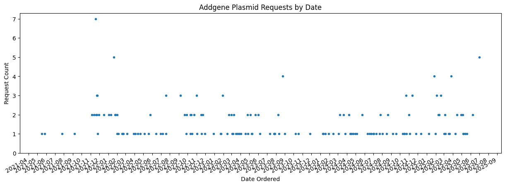
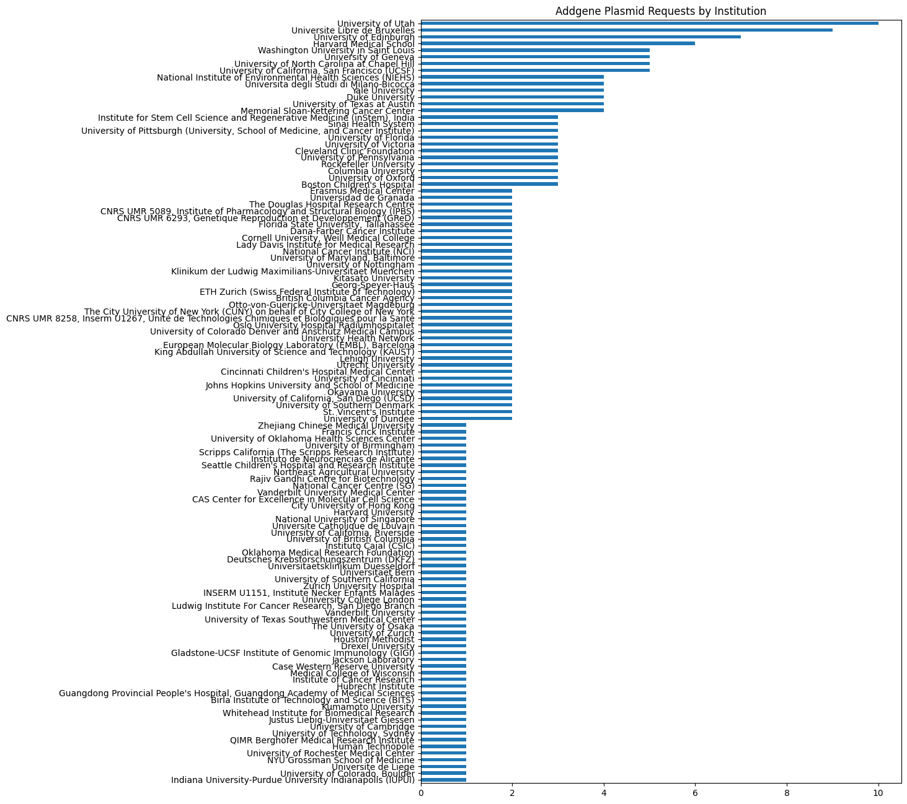

# Analysis of Brzezinski Lab Plasmid Requests from Addgene

https://www.addgene.org/depositor-collections/brzezinski-lab-crispr-collection/


```python
import pandas as pd
import matplotlib.dates as mdates
from IPython.display import display, Markdown
from IPython.display import Markdown as md
import glob

csvfile = glob.glob('*.csv')

df = pd.read_csv(csvfile[0])

number = df['Material'].value_counts().sum()
last_date = df['Date Ordered'][0]

md("# Total number of lab plasmids requested: {} as of {}.".format(number, last_date))


```


# Total number of lab plasmids requested: 102 as of 3/3/23.


## Requests by Date


```python
half_year_locator = mdates.MonthLocator(interval=1)
year_month_formatter = mdates.DateFormatter("%Y-%m") # four digits for year, two for month'Addgene-Requests-for-Materials-Michael-Kaufman-2005-2023-2023-Mar-08-18-40.csv
monthly_locator = mdates.MonthLocator()


ax = pd.to_datetime(df['Date Ordered']).value_counts().plot(title='Addgene Plasmid Requests by Date', figsize=(15, 5), style='.')

ax.set_ylabel('Request Count')
ax.set_ylim(0)
ax.xaxis.set_major_locator(half_year_locator)
ax.xaxis.set_minor_locator(monthly_locator)
ax.xaxis.set_major_formatter(year_month_formatter)

```


    

    


## Request Count


```python
(
df['Material']
.value_counts()
.sort_values()
.plot(kind='barh', title='Addgene Plasmid Requests')
.set_xlabel('Request Count')
);
```


    

    


## Request by Percent


```python
(
df['Material']
.value_counts()
.plot(kind='pie', title='Addgene Plasmid Requests', autopct='%1.1f%%', figsize=(6, 6))
.set_ylabel('')
);
```


    

    


## Requesting Institution


```python
(
df['Requesting Organization']
.value_counts()
.sort_values()
.plot(kind='barh', title='Addgene Plasmid Requests by Institution', figsize=(10, 8))
.set_ylabel('')
);
```


    

    


## Requesting Country


```python
(
df['Requesting Country']
.value_counts()
.plot(kind='pie', title='Addgene Plasmid Requests by Country', autopct='%1.1f%%', figsize=(6, 6))
.set_ylabel('')
);
```


    

    


## Plasmid Request List


```python
pd.set_option('display.max_rows', None)
df
```


<div>
<style scoped>
    .dataframe tbody tr th:only-of-type {
        vertical-align: middle;
    }

    .dataframe tbody tr th {
        vertical-align: top;
    }

    .dataframe thead th {
        text-align: right;
    }
</style>
<table border="1" class="dataframe">
  <thead>
    <tr style="text-align: right;">
      <th></th>
      <th>ID</th>
      <th>Material</th>
      <th>Requesting Organization</th>
      <th>Requesting Country</th>
      <th>Date Ordered</th>
    </tr>
  </thead>
  <tbody>
    <tr>
      <th>0</th>
      <td>159655</td>
      <td>pX458-Ef1a-Cas9-H2B-mCherry</td>
      <td>Rockefeller University</td>
      <td>UNITED STATES</td>
      <td>3/3/23</td>
    </tr>
    <tr>
      <th>1</th>
      <td>175571</td>
      <td>pX458-Ef1a-dCas9-VPR-H2B-GFP (CRISPRa)</td>
      <td>Columbia University</td>
      <td>UNITED STATES</td>
      <td>3/1/23</td>
    </tr>
    <tr>
      <th>2</th>
      <td>175572</td>
      <td>pX458-Ef1a-dCas9-VPR-H2B-mCherry (CRISPRa)</td>
      <td>Columbia University</td>
      <td>UNITED STATES</td>
      <td>3/1/23</td>
    </tr>
    <tr>
      <th>3</th>
      <td>175573</td>
      <td>pX458-Ef1a-dCas9-KRAB-MECP2-H2B-GFP (CRISPRi)</td>
      <td>Birla Institute of Technology and Science (BITS)</td>
      <td>INDIA</td>
      <td>2/15/23</td>
    </tr>
    <tr>
      <th>4</th>
      <td>159654</td>
      <td>pX458-Ef1a-Cas9-H2B-GFP</td>
      <td>Washington University in Saint Louis</td>
      <td>UNITED STATES</td>
      <td>1/30/23</td>
    </tr>
    <tr>
      <th>5</th>
      <td>171098</td>
      <td>pX458-Dual-Guide-Donor-ShuttleOnly</td>
      <td>Washington University in Saint Louis</td>
      <td>UNITED STATES</td>
      <td>1/30/23</td>
    </tr>
    <tr>
      <th>6</th>
      <td>175570</td>
      <td>pX458-Dual-Guide-Donor-Cas9-H2B-mCherry</td>
      <td>Washington University in Saint Louis</td>
      <td>UNITED STATES</td>
      <td>1/30/23</td>
    </tr>
    <tr>
      <th>7</th>
      <td>175573</td>
      <td>pX458-Ef1a-dCas9-KRAB-MECP2-H2B-GFP (CRISPRi)</td>
      <td>National Cancer Institute (NCI)</td>
      <td>UNITED STATES</td>
      <td>1/24/23</td>
    </tr>
    <tr>
      <th>8</th>
      <td>175572</td>
      <td>pX458-Ef1a-dCas9-VPR-H2B-mCherry (CRISPRa)</td>
      <td>University of Edinburgh</td>
      <td>UNITED KINGDOM</td>
      <td>1/23/23</td>
    </tr>
    <tr>
      <th>9</th>
      <td>175571</td>
      <td>pX458-Ef1a-dCas9-VPR-H2B-GFP (CRISPRa)</td>
      <td>Guangdong Provincial People's Hospital, Guangd...</td>
      <td>CHINA</td>
      <td>12/29/22</td>
    </tr>
    <tr>
      <th>10</th>
      <td>175573</td>
      <td>pX458-Ef1a-dCas9-KRAB-MECP2-H2B-GFP (CRISPRi)</td>
      <td>University of Maryland, Baltimore</td>
      <td>UNITED STATES</td>
      <td>11/29/22</td>
    </tr>
    <tr>
      <th>11</th>
      <td>175571</td>
      <td>pX458-Ef1a-dCas9-VPR-H2B-GFP (CRISPRa)</td>
      <td>University of California, San Francisco (UCSF)</td>
      <td>UNITED STATES</td>
      <td>11/22/22</td>
    </tr>
    <tr>
      <th>12</th>
      <td>175572</td>
      <td>pX458-Ef1a-dCas9-VPR-H2B-mCherry (CRISPRa)</td>
      <td>University of California, San Francisco (UCSF)</td>
      <td>UNITED STATES</td>
      <td>11/22/22</td>
    </tr>
    <tr>
      <th>13</th>
      <td>159655</td>
      <td>pX458-Ef1a-Cas9-H2B-mCherry</td>
      <td>University of Texas Southwestern Medical Center</td>
      <td>UNITED STATES</td>
      <td>11/18/22</td>
    </tr>
    <tr>
      <th>14</th>
      <td>175570</td>
      <td>pX458-Dual-Guide-Donor-Cas9-H2B-mCherry</td>
      <td>University of California, San Diego (UCSD)</td>
      <td>UNITED STATES</td>
      <td>11/17/22</td>
    </tr>
    <tr>
      <th>15</th>
      <td>175571</td>
      <td>pX458-Ef1a-dCas9-VPR-H2B-GFP (CRISPRa)</td>
      <td>University of California, San Diego (UCSD)</td>
      <td>UNITED STATES</td>
      <td>11/17/22</td>
    </tr>
    <tr>
      <th>16</th>
      <td>175571</td>
      <td>pX458-Ef1a-dCas9-VPR-H2B-GFP (CRISPRa)</td>
      <td>University of Maryland, Baltimore</td>
      <td>UNITED STATES</td>
      <td>11/2/22</td>
    </tr>
    <tr>
      <th>17</th>
      <td>159655</td>
      <td>pX458-Ef1a-Cas9-H2B-mCherry</td>
      <td>University of Geneva</td>
      <td>SWITZERLAND</td>
      <td>11/1/22</td>
    </tr>
    <tr>
      <th>18</th>
      <td>171098</td>
      <td>pX458-Dual-Guide-Donor-ShuttleOnly</td>
      <td>University of Geneva</td>
      <td>SWITZERLAND</td>
      <td>11/1/22</td>
    </tr>
    <tr>
      <th>19</th>
      <td>171101</td>
      <td>pX458-Ef1a-Cas9-H2B-mCherry (dual gRNA: Olig2 x2)</td>
      <td>University of Geneva</td>
      <td>SWITZERLAND</td>
      <td>11/1/22</td>
    </tr>
    <tr>
      <th>20</th>
      <td>175572</td>
      <td>pX458-Ef1a-dCas9-VPR-H2B-mCherry (CRISPRa)</td>
      <td>Oslo University Hospital Radiumhospitalet</td>
      <td>NORWAY</td>
      <td>10/24/22</td>
    </tr>
    <tr>
      <th>21</th>
      <td>175574</td>
      <td>pX458-Ef1a-dCas9-KRAB-MECP2-H2B-mCherry (CRISPRi)</td>
      <td>Oslo University Hospital Radiumhospitalet</td>
      <td>NORWAY</td>
      <td>10/24/22</td>
    </tr>
    <tr>
      <th>22</th>
      <td>171098</td>
      <td>pX458-Dual-Guide-Donor-ShuttleOnly</td>
      <td>University of Zurich</td>
      <td>SWITZERLAND</td>
      <td>10/17/22</td>
    </tr>
    <tr>
      <th>23</th>
      <td>175570</td>
      <td>pX458-Dual-Guide-Donor-Cas9-H2B-mCherry</td>
      <td>University of Edinburgh</td>
      <td>UNITED KINGDOM</td>
      <td>10/14/22</td>
    </tr>
    <tr>
      <th>24</th>
      <td>175573</td>
      <td>pX458-Ef1a-dCas9-KRAB-MECP2-H2B-GFP (CRISPRi)</td>
      <td>Osaka University</td>
      <td>JAPAN</td>
      <td>10/14/22</td>
    </tr>
    <tr>
      <th>25</th>
      <td>175573</td>
      <td>pX458-Ef1a-dCas9-KRAB-MECP2-H2B-GFP (CRISPRi)</td>
      <td>University of Southern Denmark</td>
      <td>DENMARK</td>
      <td>10/11/22</td>
    </tr>
    <tr>
      <th>26</th>
      <td>175574</td>
      <td>pX458-Ef1a-dCas9-KRAB-MECP2-H2B-mCherry (CRISPRi)</td>
      <td>University of Southern Denmark</td>
      <td>DENMARK</td>
      <td>10/11/22</td>
    </tr>
    <tr>
      <th>27</th>
      <td>159655</td>
      <td>pX458-Ef1a-Cas9-H2B-mCherry</td>
      <td>University of Florida</td>
      <td>UNITED STATES</td>
      <td>10/10/22</td>
    </tr>
    <tr>
      <th>28</th>
      <td>175572</td>
      <td>pX458-Ef1a-dCas9-VPR-H2B-mCherry (CRISPRa)</td>
      <td>CNRS UMR 8258, Inserm U1267, Unité de Technolo...</td>
      <td>FRANCE</td>
      <td>9/28/22</td>
    </tr>
    <tr>
      <th>29</th>
      <td>175574</td>
      <td>pX458-Ef1a-dCas9-KRAB-MECP2-H2B-mCherry (CRISPRi)</td>
      <td>CNRS UMR 8258, Inserm U1267, Unité de Technolo...</td>
      <td>FRANCE</td>
      <td>9/28/22</td>
    </tr>
    <tr>
      <th>30</th>
      <td>175573</td>
      <td>pX458-Ef1a-dCas9-KRAB-MECP2-H2B-GFP (CRISPRi)</td>
      <td>The City University of New York (CUNY) on beha...</td>
      <td>UNITED STATES</td>
      <td>9/27/22</td>
    </tr>
    <tr>
      <th>31</th>
      <td>159654</td>
      <td>pX458-Ef1a-Cas9-H2B-GFP</td>
      <td>CNRS UMR 6293, Genetique Reproduction et Devel...</td>
      <td>FRANCE</td>
      <td>9/20/22</td>
    </tr>
    <tr>
      <th>32</th>
      <td>159655</td>
      <td>pX458-Ef1a-Cas9-H2B-mCherry</td>
      <td>CNRS UMR 6293, Genetique Reproduction et Devel...</td>
      <td>FRANCE</td>
      <td>9/20/22</td>
    </tr>
    <tr>
      <th>33</th>
      <td>175570</td>
      <td>pX458-Dual-Guide-Donor-Cas9-H2B-mCherry</td>
      <td>Cleveland Clinic Foundation</td>
      <td>UNITED STATES</td>
      <td>9/7/22</td>
    </tr>
    <tr>
      <th>34</th>
      <td>175573</td>
      <td>pX458-Ef1a-dCas9-KRAB-MECP2-H2B-GFP (CRISPRi)</td>
      <td>Cleveland Clinic Foundation</td>
      <td>UNITED STATES</td>
      <td>9/7/22</td>
    </tr>
    <tr>
      <th>35</th>
      <td>175574</td>
      <td>pX458-Ef1a-dCas9-KRAB-MECP2-H2B-mCherry (CRISPRi)</td>
      <td>Cleveland Clinic Foundation</td>
      <td>UNITED STATES</td>
      <td>9/7/22</td>
    </tr>
    <tr>
      <th>36</th>
      <td>175571</td>
      <td>pX458-Ef1a-dCas9-VPR-H2B-GFP (CRISPRa)</td>
      <td>Vanderbilt University and Medical Center</td>
      <td>UNITED STATES</td>
      <td>7/19/22</td>
    </tr>
    <tr>
      <th>37</th>
      <td>159654</td>
      <td>pX458-Ef1a-Cas9-H2B-GFP</td>
      <td>University of Edinburgh</td>
      <td>UNITED KINGDOM</td>
      <td>7/18/22</td>
    </tr>
    <tr>
      <th>38</th>
      <td>159657</td>
      <td>pX458-Ef1a-Cas9-GFP (gRNA: Ascl1-2)</td>
      <td>University of Edinburgh</td>
      <td>UNITED KINGDOM</td>
      <td>7/18/22</td>
    </tr>
    <tr>
      <th>39</th>
      <td>159658</td>
      <td>pX458-Ef1a-Cas9-GFP (gRNA: Ascl1-3)</td>
      <td>University of Edinburgh</td>
      <td>UNITED KINGDOM</td>
      <td>7/18/22</td>
    </tr>
    <tr>
      <th>40</th>
      <td>175572</td>
      <td>pX458-Ef1a-dCas9-VPR-H2B-mCherry (CRISPRa)</td>
      <td>Harvard Medical School</td>
      <td>UNITED STATES</td>
      <td>7/7/22</td>
    </tr>
    <tr>
      <th>41</th>
      <td>175573</td>
      <td>pX458-Ef1a-dCas9-KRAB-MECP2-H2B-GFP (CRISPRi)</td>
      <td>Cincinnati Children's Hospital Medical Center</td>
      <td>UNITED STATES</td>
      <td>6/30/22</td>
    </tr>
    <tr>
      <th>42</th>
      <td>171102</td>
      <td>pX458-Ef1a-Cas9-H2B-mCherry (dual gRNA: Otx2 x2)</td>
      <td>Ludwig Institute For Cancer Research, San Dieg...</td>
      <td>UNITED STATES</td>
      <td>6/14/22</td>
    </tr>
    <tr>
      <th>43</th>
      <td>175572</td>
      <td>pX458-Ef1a-dCas9-VPR-H2B-mCherry (CRISPRa)</td>
      <td>University of Pennsylvania</td>
      <td>UNITED STATES</td>
      <td>5/25/22</td>
    </tr>
    <tr>
      <th>44</th>
      <td>175574</td>
      <td>pX458-Ef1a-dCas9-KRAB-MECP2-H2B-mCherry (CRISPRi)</td>
      <td>University of Pennsylvania</td>
      <td>UNITED STATES</td>
      <td>5/25/22</td>
    </tr>
    <tr>
      <th>45</th>
      <td>159654</td>
      <td>pX458-Ef1a-Cas9-H2B-GFP</td>
      <td>University College London</td>
      <td>UNITED KINGDOM</td>
      <td>5/19/22</td>
    </tr>
    <tr>
      <th>46</th>
      <td>175572</td>
      <td>pX458-Ef1a-dCas9-VPR-H2B-mCherry (CRISPRa)</td>
      <td>National Institute of Environmental Health Sci...</td>
      <td>UNITED STATES</td>
      <td>5/5/22</td>
    </tr>
    <tr>
      <th>47</th>
      <td>175574</td>
      <td>pX458-Ef1a-dCas9-KRAB-MECP2-H2B-mCherry (CRISPRi)</td>
      <td>Rockefeller University</td>
      <td>UNITED STATES</td>
      <td>4/21/22</td>
    </tr>
    <tr>
      <th>48</th>
      <td>171098</td>
      <td>pX458-Dual-Guide-Donor-ShuttleOnly</td>
      <td>INSERM U1151, Institute Necker Enfants Malades</td>
      <td>FRANCE</td>
      <td>4/12/22</td>
    </tr>
    <tr>
      <th>49</th>
      <td>159655</td>
      <td>pX458-Ef1a-Cas9-H2B-mCherry</td>
      <td>Universite Libre de Bruxelles</td>
      <td>BELGIUM</td>
      <td>4/4/22</td>
    </tr>
    <tr>
      <th>50</th>
      <td>175571</td>
      <td>pX458-Ef1a-dCas9-VPR-H2B-GFP (CRISPRa)</td>
      <td>The Methodist Hospital Research Institute</td>
      <td>UNITED STATES</td>
      <td>3/30/22</td>
    </tr>
    <tr>
      <th>51</th>
      <td>175571</td>
      <td>pX458-Ef1a-dCas9-VPR-H2B-GFP (CRISPRa)</td>
      <td>Case Western Reserve University</td>
      <td>UNITED STATES</td>
      <td>3/7/22</td>
    </tr>
    <tr>
      <th>52</th>
      <td>159655</td>
      <td>pX458-Ef1a-Cas9-H2B-mCherry</td>
      <td>Universite Libre de Bruxelles</td>
      <td>BELGIUM</td>
      <td>2/22/22</td>
    </tr>
    <tr>
      <th>53</th>
      <td>171098</td>
      <td>pX458-Dual-Guide-Donor-ShuttleOnly</td>
      <td>Drexel University</td>
      <td>UNITED STATES</td>
      <td>2/21/22</td>
    </tr>
    <tr>
      <th>54</th>
      <td>175573</td>
      <td>pX458-Ef1a-dCas9-KRAB-MECP2-H2B-GFP (CRISPRi)</td>
      <td>Gladstone-UCSF Institute of Genomic Immunology...</td>
      <td>UNITED STATES</td>
      <td>2/17/22</td>
    </tr>
    <tr>
      <th>55</th>
      <td>159654</td>
      <td>pX458-Ef1a-Cas9-H2B-GFP</td>
      <td>Jackson Laboratory</td>
      <td>UNITED STATES</td>
      <td>2/4/22</td>
    </tr>
    <tr>
      <th>56</th>
      <td>159654</td>
      <td>pX458-Ef1a-Cas9-H2B-GFP</td>
      <td>Florida State University, Tallahassee</td>
      <td>UNITED STATES</td>
      <td>2/1/22</td>
    </tr>
    <tr>
      <th>57</th>
      <td>159655</td>
      <td>pX458-Ef1a-Cas9-H2B-mCherry</td>
      <td>Florida State University, Tallahassee</td>
      <td>UNITED STATES</td>
      <td>2/1/22</td>
    </tr>
    <tr>
      <th>58</th>
      <td>175572</td>
      <td>pX458-Ef1a-dCas9-VPR-H2B-mCherry (CRISPRa)</td>
      <td>University of Utah</td>
      <td>UNITED STATES</td>
      <td>1/31/22</td>
    </tr>
    <tr>
      <th>59</th>
      <td>175571</td>
      <td>pX458-Ef1a-dCas9-VPR-H2B-GFP (CRISPRa)</td>
      <td>Erasmus Medical Center</td>
      <td>NETHERLANDS</td>
      <td>1/26/22</td>
    </tr>
    <tr>
      <th>60</th>
      <td>175572</td>
      <td>pX458-Ef1a-dCas9-VPR-H2B-mCherry (CRISPRa)</td>
      <td>Erasmus Medical Center</td>
      <td>NETHERLANDS</td>
      <td>1/26/22</td>
    </tr>
    <tr>
      <th>61</th>
      <td>175573</td>
      <td>pX458-Ef1a-dCas9-KRAB-MECP2-H2B-GFP (CRISPRi)</td>
      <td>University of Dundee</td>
      <td>UNITED KINGDOM</td>
      <td>1/24/22</td>
    </tr>
    <tr>
      <th>62</th>
      <td>175574</td>
      <td>pX458-Ef1a-dCas9-KRAB-MECP2-H2B-mCherry (CRISPRi)</td>
      <td>University of Dundee</td>
      <td>UNITED KINGDOM</td>
      <td>1/24/22</td>
    </tr>
    <tr>
      <th>63</th>
      <td>159654</td>
      <td>pX458-Ef1a-Cas9-H2B-GFP</td>
      <td>University of Utah</td>
      <td>UNITED STATES</td>
      <td>1/20/22</td>
    </tr>
    <tr>
      <th>64</th>
      <td>159655</td>
      <td>pX458-Ef1a-Cas9-H2B-mCherry</td>
      <td>University of Utah</td>
      <td>UNITED STATES</td>
      <td>1/20/22</td>
    </tr>
    <tr>
      <th>65</th>
      <td>171098</td>
      <td>pX458-Dual-Guide-Donor-ShuttleOnly</td>
      <td>University of Utah</td>
      <td>UNITED STATES</td>
      <td>1/20/22</td>
    </tr>
    <tr>
      <th>66</th>
      <td>175573</td>
      <td>pX458-Ef1a-dCas9-KRAB-MECP2-H2B-GFP (CRISPRi)</td>
      <td>University of Utah</td>
      <td>UNITED STATES</td>
      <td>1/20/22</td>
    </tr>
    <tr>
      <th>67</th>
      <td>175574</td>
      <td>pX458-Ef1a-dCas9-KRAB-MECP2-H2B-mCherry (CRISPRi)</td>
      <td>University of Utah</td>
      <td>UNITED STATES</td>
      <td>1/20/22</td>
    </tr>
    <tr>
      <th>68</th>
      <td>159654</td>
      <td>pX458-Ef1a-Cas9-H2B-GFP</td>
      <td>University of Cincinnati</td>
      <td>UNITED STATES</td>
      <td>1/10/22</td>
    </tr>
    <tr>
      <th>69</th>
      <td>175570</td>
      <td>pX458-Dual-Guide-Donor-Cas9-H2B-mCherry</td>
      <td>University of Cincinnati</td>
      <td>UNITED STATES</td>
      <td>1/10/22</td>
    </tr>
    <tr>
      <th>70</th>
      <td>159654</td>
      <td>pX458-Ef1a-Cas9-H2B-GFP</td>
      <td>Harvard Medical School</td>
      <td>UNITED STATES</td>
      <td>1/3/22</td>
    </tr>
    <tr>
      <th>71</th>
      <td>175570</td>
      <td>pX458-Dual-Guide-Donor-Cas9-H2B-mCherry</td>
      <td>Harvard Medical School</td>
      <td>UNITED STATES</td>
      <td>1/3/22</td>
    </tr>
    <tr>
      <th>72</th>
      <td>175570</td>
      <td>pX458-Dual-Guide-Donor-Cas9-H2B-mCherry</td>
      <td>Lady Davis Institute for Medical Research</td>
      <td>CANADA</td>
      <td>12/17/21</td>
    </tr>
    <tr>
      <th>73</th>
      <td>175573</td>
      <td>pX458-Ef1a-dCas9-KRAB-MECP2-H2B-GFP (CRISPRi)</td>
      <td>Lady Davis Institute for Medical Research</td>
      <td>CANADA</td>
      <td>12/17/21</td>
    </tr>
    <tr>
      <th>74</th>
      <td>175571</td>
      <td>pX458-Ef1a-dCas9-VPR-H2B-GFP (CRISPRa)</td>
      <td>Harvard Medical School</td>
      <td>UNITED STATES</td>
      <td>11/29/21</td>
    </tr>
    <tr>
      <th>75</th>
      <td>175573</td>
      <td>pX458-Ef1a-dCas9-KRAB-MECP2-H2B-GFP (CRISPRi)</td>
      <td>Harvard Medical School</td>
      <td>UNITED STATES</td>
      <td>11/29/21</td>
    </tr>
    <tr>
      <th>76</th>
      <td>171098</td>
      <td>pX458-Dual-Guide-Donor-ShuttleOnly</td>
      <td>Sinai Health System</td>
      <td>CANADA</td>
      <td>11/25/21</td>
    </tr>
    <tr>
      <th>77</th>
      <td>175570</td>
      <td>pX458-Dual-Guide-Donor-Cas9-H2B-mCherry</td>
      <td>Boston Children's Hospital</td>
      <td>UNITED STATES</td>
      <td>11/24/21</td>
    </tr>
    <tr>
      <th>78</th>
      <td>175571</td>
      <td>pX458-Ef1a-dCas9-VPR-H2B-GFP (CRISPRa)</td>
      <td>Boston Children's Hospital</td>
      <td>UNITED STATES</td>
      <td>11/24/21</td>
    </tr>
    <tr>
      <th>79</th>
      <td>175574</td>
      <td>pX458-Ef1a-dCas9-KRAB-MECP2-H2B-mCherry (CRISPRi)</td>
      <td>Boston Children's Hospital</td>
      <td>UNITED STATES</td>
      <td>11/24/21</td>
    </tr>
    <tr>
      <th>80</th>
      <td>159654</td>
      <td>pX458-Ef1a-Cas9-H2B-GFP</td>
      <td>Institute for Stem Cell Science and Regenerati...</td>
      <td>INDIA</td>
      <td>11/23/21</td>
    </tr>
    <tr>
      <th>81</th>
      <td>159655</td>
      <td>pX458-Ef1a-Cas9-H2B-mCherry</td>
      <td>Institute for Stem Cell Science and Regenerati...</td>
      <td>INDIA</td>
      <td>11/23/21</td>
    </tr>
    <tr>
      <th>82</th>
      <td>175570</td>
      <td>pX458-Dual-Guide-Donor-Cas9-H2B-mCherry</td>
      <td>Institute for Stem Cell Science and Regenerati...</td>
      <td>INDIA</td>
      <td>11/23/21</td>
    </tr>
    <tr>
      <th>83</th>
      <td>175571</td>
      <td>pX458-Ef1a-dCas9-VPR-H2B-GFP (CRISPRa)</td>
      <td>University of Geneva</td>
      <td>SWITZERLAND</td>
      <td>11/22/21</td>
    </tr>
    <tr>
      <th>84</th>
      <td>175573</td>
      <td>pX458-Ef1a-dCas9-KRAB-MECP2-H2B-GFP (CRISPRi)</td>
      <td>University of Geneva</td>
      <td>SWITZERLAND</td>
      <td>11/22/21</td>
    </tr>
    <tr>
      <th>85</th>
      <td>171098</td>
      <td>pX458-Dual-Guide-Donor-ShuttleOnly</td>
      <td>University Health Network</td>
      <td>CANADA</td>
      <td>11/19/21</td>
    </tr>
    <tr>
      <th>86</th>
      <td>175570</td>
      <td>pX458-Dual-Guide-Donor-Cas9-H2B-mCherry</td>
      <td>University Health Network</td>
      <td>CANADA</td>
      <td>11/19/21</td>
    </tr>
    <tr>
      <th>87</th>
      <td>159655</td>
      <td>pX458-Ef1a-Cas9-H2B-mCherry</td>
      <td>Universite Libre de Bruxelles</td>
      <td>BELGIUM</td>
      <td>11/18/21</td>
    </tr>
    <tr>
      <th>88</th>
      <td>171098</td>
      <td>pX458-Dual-Guide-Donor-ShuttleOnly</td>
      <td>Universite Libre de Bruxelles</td>
      <td>BELGIUM</td>
      <td>11/18/21</td>
    </tr>
    <tr>
      <th>89</th>
      <td>175570</td>
      <td>pX458-Dual-Guide-Donor-Cas9-H2B-mCherry</td>
      <td>Universite Libre de Bruxelles</td>
      <td>BELGIUM</td>
      <td>11/18/21</td>
    </tr>
    <tr>
      <th>90</th>
      <td>175571</td>
      <td>pX458-Ef1a-dCas9-VPR-H2B-GFP (CRISPRa)</td>
      <td>Universite Libre de Bruxelles</td>
      <td>BELGIUM</td>
      <td>11/18/21</td>
    </tr>
    <tr>
      <th>91</th>
      <td>175572</td>
      <td>pX458-Ef1a-dCas9-VPR-H2B-mCherry (CRISPRa)</td>
      <td>Universite Libre de Bruxelles</td>
      <td>BELGIUM</td>
      <td>11/18/21</td>
    </tr>
    <tr>
      <th>92</th>
      <td>175573</td>
      <td>pX458-Ef1a-dCas9-KRAB-MECP2-H2B-GFP (CRISPRi)</td>
      <td>Universite Libre de Bruxelles</td>
      <td>BELGIUM</td>
      <td>11/18/21</td>
    </tr>
    <tr>
      <th>93</th>
      <td>175574</td>
      <td>pX458-Ef1a-dCas9-KRAB-MECP2-H2B-mCherry (CRISPRi)</td>
      <td>Universite Libre de Bruxelles</td>
      <td>BELGIUM</td>
      <td>11/18/21</td>
    </tr>
    <tr>
      <th>94</th>
      <td>171098</td>
      <td>pX458-Dual-Guide-Donor-ShuttleOnly</td>
      <td>Dana-Farber Cancer Institute</td>
      <td>UNITED STATES</td>
      <td>11/13/21</td>
    </tr>
    <tr>
      <th>95</th>
      <td>175570</td>
      <td>pX458-Dual-Guide-Donor-Cas9-H2B-mCherry</td>
      <td>Dana-Farber Cancer Institute</td>
      <td>UNITED STATES</td>
      <td>11/13/21</td>
    </tr>
    <tr>
      <th>96</th>
      <td>175572</td>
      <td>pX458-Ef1a-dCas9-VPR-H2B-mCherry (CRISPRa)</td>
      <td>University of Edinburgh</td>
      <td>UNITED KINGDOM</td>
      <td>11/5/21</td>
    </tr>
    <tr>
      <th>97</th>
      <td>175574</td>
      <td>pX458-Ef1a-dCas9-KRAB-MECP2-H2B-mCherry (CRISPRi)</td>
      <td>University of Edinburgh</td>
      <td>UNITED KINGDOM</td>
      <td>11/5/21</td>
    </tr>
    <tr>
      <th>98</th>
      <td>159655</td>
      <td>pX458-Ef1a-Cas9-H2B-mCherry</td>
      <td>Medical College of Wisconsin</td>
      <td>UNITED STATES</td>
      <td>9/7/21</td>
    </tr>
    <tr>
      <th>99</th>
      <td>159655</td>
      <td>pX458-Ef1a-Cas9-H2B-mCherry</td>
      <td>Washington University in Saint Louis</td>
      <td>UNITED STATES</td>
      <td>7/26/21</td>
    </tr>
    <tr>
      <th>100</th>
      <td>159655</td>
      <td>pX458-Ef1a-Cas9-H2B-mCherry</td>
      <td>Institute of Cancer Research</td>
      <td>UNITED KINGDOM</td>
      <td>5/27/21</td>
    </tr>
    <tr>
      <th>101</th>
      <td>159655</td>
      <td>pX458-Ef1a-Cas9-H2B-mCherry</td>
      <td>Hubrecht Institute</td>
      <td>NETHERLANDS</td>
      <td>5/17/21</td>
    </tr>
  </tbody>
</table>
</div>


