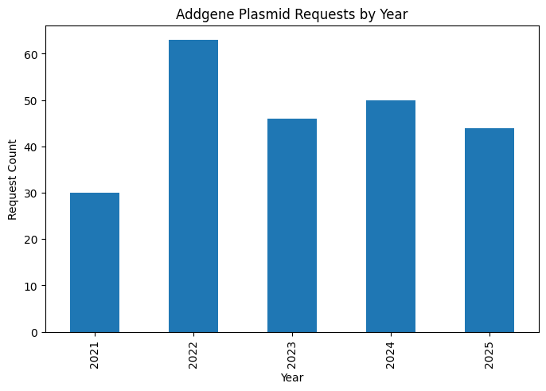
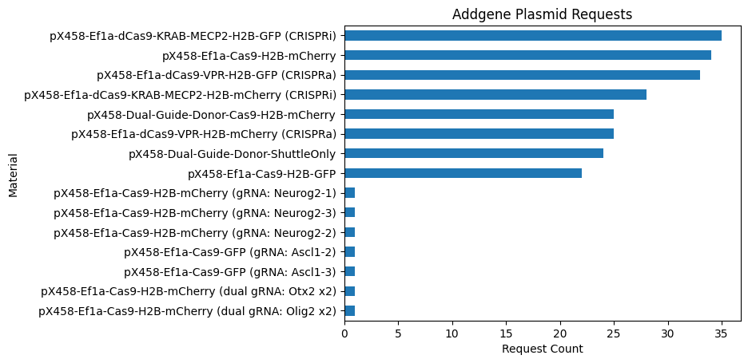
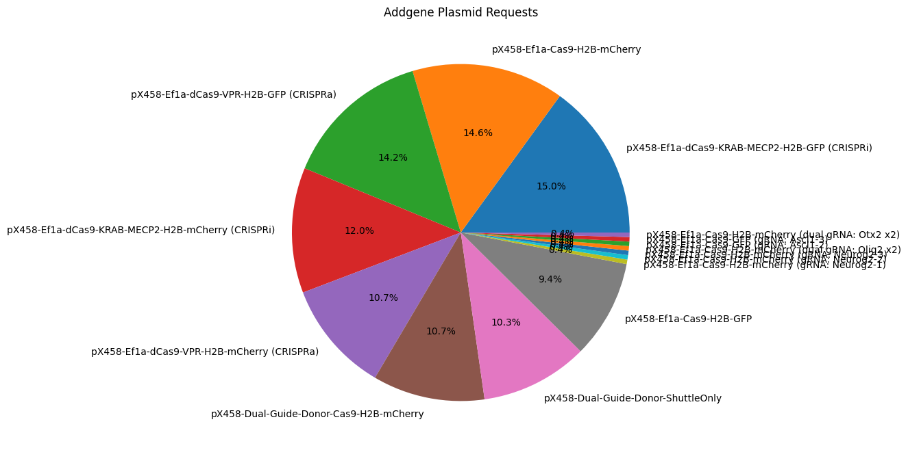
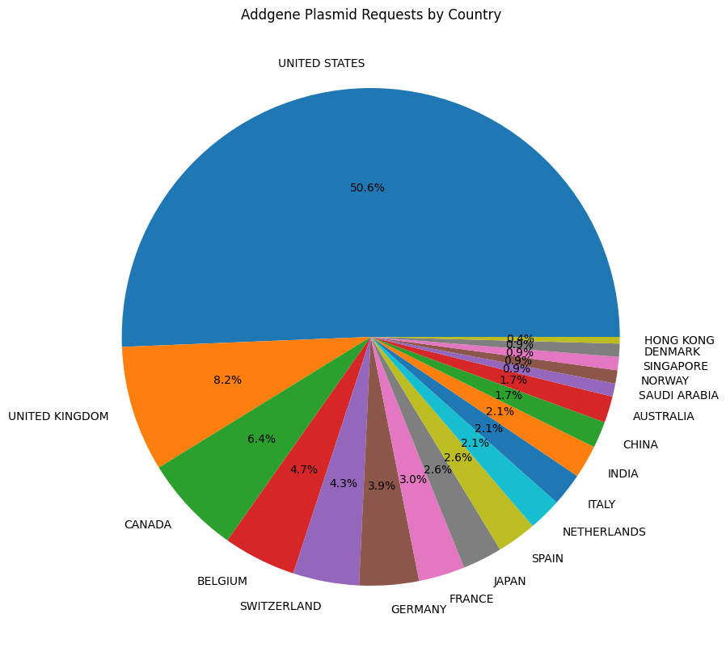

# Analysis of Brzezinski Lab Plasmid Requests from Addgene

https://www.addgene.org/depositor-collections/brzezinski-lab-crispr-collection/


```python
import pandas as pd
import matplotlib.dates as mdates
import matplotlib.pyplot as plt
from IPython.display import display, Markdown
from IPython.display import Markdown as md
import glob

csvfile = glob.glob('*.csv')

df = pd.read_csv(csvfile[0])

number = df['Material'].value_counts().sum()
last_date = df['Date Ordered'][0]

md("# Total number of lab plasmids requested: {} as of {}.".format(number, last_date))


```


# Total number of lab plasmids requested: 189 as of 12/12/2024.


## Requests by Date


```python
half_year_locator = mdates.MonthLocator(interval=1)
year_month_formatter = mdates.DateFormatter("%Y-%m") # four digits for year, two for month'Addgene-Requests-for-Materials-Michael-Kaufman-2005-2023-2023-Mar-08-18-40.csv
monthly_locator = mdates.MonthLocator()


ax = pd.to_datetime(df['Date Ordered']).value_counts().plot(title='Addgene Plasmid Requests by Date', figsize=(15, 5), style='.')

ax.set_ylabel('Request Count')
ax.set_ylim(0)
ax.xaxis.set_major_locator(half_year_locator)
ax.xaxis.set_minor_locator(monthly_locator)
ax.xaxis.set_major_formatter(year_month_formatter)

```


    

    


## Requests by Year


```python
df['Year'] = pd.to_datetime(df['Date Ordered']).dt.year
yearly_counts = df['Year'].value_counts().sort_index()

fig, ax = plt.subplots(figsize=(8, 5))
yearly_counts.plot(kind='bar', ax=ax, title='Addgene Plasmid Requests by Year')

ax.set_ylabel('Request Count')
ax.set_xlabel('Year')
ax.set_ylim(0)
```


    (0.0, 66.15)


    

    


## Request Count


```python
(
df['Material']
.value_counts()
.sort_values()
.plot(kind='barh', title='Addgene Plasmid Requests')
.set_xlabel('Request Count')
);
```


    

    


## Request by Percent


```python
(
df['Material']
.value_counts()
.plot(kind='pie', title='Addgene Plasmid Requests', autopct='%1.1f%%', figsize=(8, 8))
.set_ylabel('')
);
```


    

    


## Requesting Institution


```python
(
df['Requesting Organization']
.value_counts()
.sort_values()
.plot(kind='barh', title='Addgene Plasmid Requests by Institution', figsize=(10,16))
.set_ylabel('')
);
```


    

    


## Requesting Country


```python
(
df['Requesting Country']
.value_counts()
.plot(kind='pie', title='Addgene Plasmid Requests by Country', autopct='%1.1f%%', figsize=(10, 10))
.set_ylabel('')
);
```


    

    


## Plasmid Request List


```python
pd.set_option('display.max_rows', None)
#df
```
